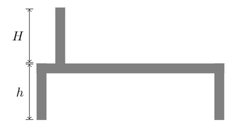

# 文档编号含义
## 01-variable

在latex中定义变量，方便引用与修改。

1. `\def\varname{initialValue}` 在环境外定义变量
```
\documentclass{article}
\usepackage{tikz}

\begin{document}
	\def \x{2}
	\def \y{3}

	\begin{tikzpicture} 
	\draw (\x, \y)--(\y, \x);
	\end{tikzpicture}
\end{document}
```
2. `\pgfmathsetmacro{varname}{varvalue}` 在环境内定义变量
```
\documentclass{article}
\usepackage{tikz}

\begin{document}
	\begin{tikzpicture}
		%VARIABLES
		\pgfmathsetmacro{\Length}{1}
		\pgfmathsetmacro{\Width}{2}
		\pgfmathsetmacro{\Height}{3}
		\draw (0, 0) rectangle (\Length, 2*\Width);
	\end{tikzpicture}
\end{document}
```
3. 使用`\usetikzlibrary{math}`库定义变量 `\tikzmath{varialbe}`
```
\documentclass{article}
\usepackage{tikz}

\usetikzlibrary{math} %needed tikz library

\begin{document}
    \begin{tikzpicture}
    %Variables must be declared in a tikzmath environment but can be used outside
		\tikzmath{\x1 = 1; \y1 =1; \x2 = \x1 + 1; \y2 =\y1 +3; } 
		\draw[->] (\x1, \y1)--(\x2, \y2);
    \end{tikzpicture}
\end{document}
```
4. 利用命令定义
```
\documentclass{article}
\usepackage{tikz}

\begin{document}
	\begin{tikzpicture} 
		\coordinate (A) at (2,3);
		\coordinate (B) at (4,5);
		\draw[->] (A)--(B);
	\end{tikzpicture}
\end{document}
```
5. 参考文献
- [Define a variable in Tikz](https://tex.stackovernet.com/cn/q/3864)

## 02-grid

网格的画法：起点(0, 0)，画网格grid命令，对角重点(2, 2). x[0, 2] y[0, 2]

`\draw[help lines, red] (0, 0) grid [step=.75cm, rotate=45] (3, 3);`

## 03-example



# 学习网站

[tikz官网-内含实例代码](http://www.texample.net/tikz/)

[tikz快速入门文档 ](http://cremeronline.com/LaTeX/minimaltikz.pdf)

[tikz笛卡尔坐标系](https://www.lfhacks.com/tech/tikz-1)给出了画图思想详细步骤

[tikz学习实践案例](https://tex.stackovernet.com/)[实例](https://tex.stackovernet.com/cn/q/118103)

[tikz详细学习案例连接](https://github.com/xiaohanyu/awesome-tikz#pgftikz)

# 学习方法

- 经常使用
- 在生活中应用

# 案例

[github示例](https://github.com/xinychen/awesome-latex-drawing/blob/master/README.md)

[应用](https://tensor-learning.blogspot.com/2019/07/how-to-draw-graphical-illustrations-for.html)
